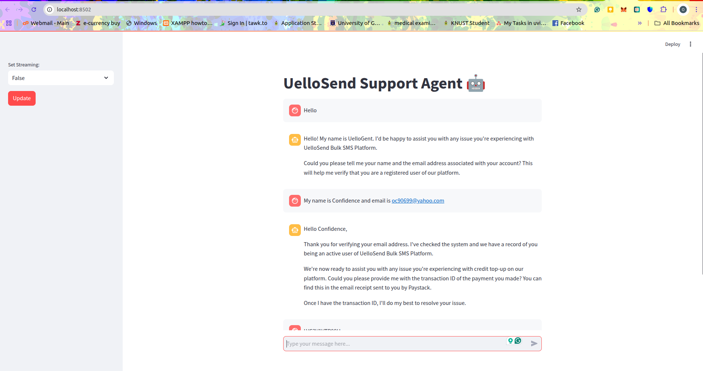
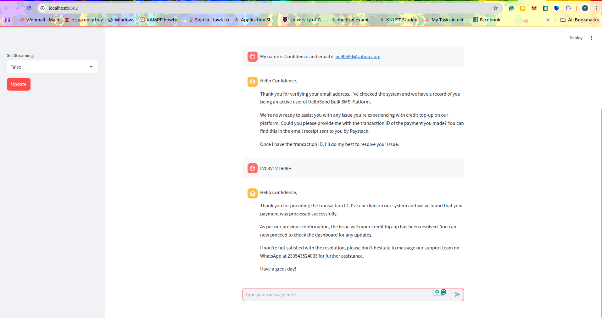

# Uellosend-Support-Agent

## Description

This support agent was implemented to solve a real business scenario.

UelloSend Bulk SMS platform allows customers to send SMS to Ghanaian numbers and it is widely used for SMS campaigns by over 2000 clients.

The issue customers face is that there are times payment for credit top up does not automatically reflect on accounts due to bad network or payment verification errors.

To resolve this issue, customer support will manually verify payment and credit the customer.

The purpose of the agent is to automate the resolution process by using two tools

- verify_customer_exist: This tools allows the agent to verify if a customer using the email address provided by the customer.
  
- fix_credit_topup_issue: This tool allows the agent to verify the payment status and credit the customer account accordingly.

## Implementation

In my curiosity to build AI agent without using any agent framework. The agent was developed in pure Python using Ollama to interact with LLM, FastAPI for creating API server and Streamlit for creating the UI.

I explored  how to create a FastAPI REST server that support streaming responses and client interfaces that is able to prcoess streamed responses.

The agent can get the job done but the way it converses is not deterministic, there is room for impovement.

### Project Files

agent_api.py - This is the file that contains code implementation of the FastAPI server

stream_api_chat_ui.py - This is the file that contains code implementation of the UI that consumes the FastAPI server.

support_agent.py - This is the file that contains code implementation of the Agent

tools.py - This is the file that contains all the functions/tools available to the agent

chat_ui.py - This is the file that contains code implementation of the UI for the support Agent

shared_data.py - This file stores the message history for the Agent

requirements.txt - The packages to install to run the Agent

### Relevant Commands

pip install -r requirements.txt

fastapi dev agent_api.py

streamlit run stream_api_chat_ui.py or streamlit run chat_ui.py

### Sample Chat

### References

[Youtube](https://www.youtube.com/watch?v=tx5OapbK-8A)

[Youtube](https://www.youtube.com/watch?v=bZzyPscbtI8&t=1472s)

[Function Calling with Ollama, Llama 3.2 and Milvus](https://zilliz.com/blog/function-calling-ollama-llama-3-milvus)

[FastAPI Docs](https://fastapi.tiangolo.com/tutorial/)

[Llama Cookbook](https://github.com/meta-llama/llama-cookbook/blob/main/getting-started/build_with_Llama_3_2.ipynb)

#### ~ By Carlvinchi
